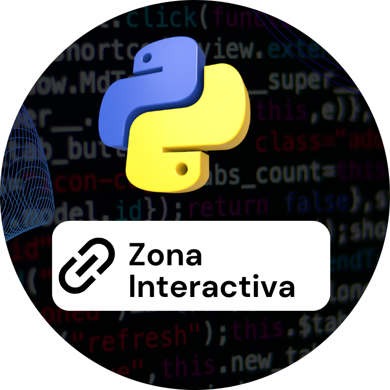

<h1 align="center"> Atlas Interactivo de Programacion en Python</h1>

  

Aprende Python desde cero hasta avanzado con nuestra guía interactiva GRATUITA</strong> 
  <em>13 secciones, ejercicios prácticos, proyectos reales y contenido actualizado.</em>

## ¿Qué obtendrás?

✅ Aprende los fundamentos de Python, desde los conceptos básicos hasta su aplicación práctica  
✅ Ejercicios prácticos con soluciones detalladas  
✅ Proyectos reales orientados a la construcción de portafolio  
✅ Contenido visual e interactivo para facilitar el aprendizaje  
✅ **Insignia digital verificable al completar el proyecto final**

**Insignia digital verificable**

Al completar el **Proyecto Final del Atlas Interactivo de Programación en Python**,  
los aprendices podrán obtener una **insignia digital verificable**, emitida
oficialmente por el Atlas y registrada públicamente en GitHub.

  

  <strong>Insignia verificable · Proyecto Final</strong> 
  Atlas Interactivo de Programación en Python

 **Verificación**

Cada insignia:
- Cuenta con un **registro individual por aprendiz**
- Incluye nombre, fecha y descripción del logro
- Puede ser **auditada públicamente** mediante el historial de GitHub

🔗 Repositorio oficial de insignias:  
https://github.com/eduardoleon9010/atlas-python-insignias

## ¿Por qué este Atlas es diferente?

 ✅ Diseñado para autodidactas  | ✅ Ejemplos claros y aplicables  | ✅ Comunidad activa y aprendizaje colaborativo 

**Vista previa**

  

**Política de privacidad y Terminos y condiciones**

  

  

**Contacto**

  ¿Tienes dudas? Escríbenos a: 
  📧 <strong>formacionexatech@gmail.com</strong>

**Visítanos**

  

<h3>Atlas Interactivo de Programación en Python</h3>

Una guía práctica para la era digital

Proyecto académico y educativo

© 2024 · Todos los derechos reservados

<code>aprender(); ejecutar(); comprender();</code>

